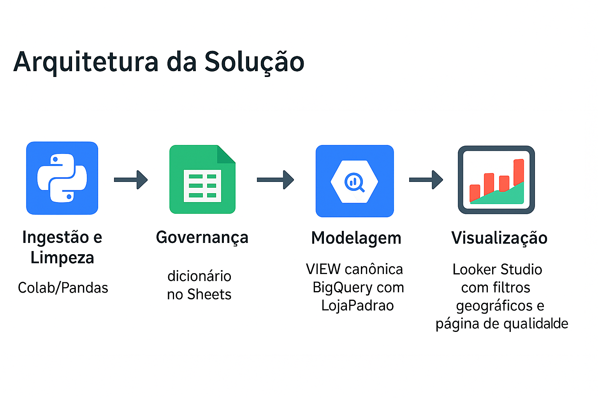

# 🗺️ bi-atendimento-mapa

Mapa de cobertura por promotor (farmácias) com Colab/Pandas na ingestão e limpeza, dicionário no Google Sheets, VIEW canônica no BigQuery e visualização no Looker Studio; contagem única via LojaPadrao, filtros geográficos is not null e página de Qualidade do Dado.

## 🚀 Objetivo

Monitorar cobertura por rede/loja/região com regras padronizadas e rastreabilidade fim a fim.

- Ingestão e tratamento com Python/Colab e Pandas.
- Dicionário operacional no Google Sheets, referenciado no pipeline.
- Camada semântica única no BigQuery (VIEW canônica) para consumo no Looker Studio.

## 📐 Arquitetura da Solução

1) Ingestão e Limpeza (Colab/Pandas).  
2) Governança (dicionário no Sheets).  
3) Modelagem (VIEW canônica BigQuery com LojaPadrao).  
4) Visualização (Looker Studio com filtros geográficos e página de qualidade).

## 🔗 Dashboard

Gráfico ao vivo (Looker Studio): 
https://lookerstudio.google.com/s/pA3Yfb3Z2hs

bi-atendimento-mapa/
├── etl/
│ └── colab_ingestao_limpeza.ipynb
├── dicionario/
│ └── dicionario_dados_sheets.md
├── bigquery/
│ ├── view_canonica.sql
│ └── helpers.sql
├── dashboard/
│ ├── grafico_cobertura_rede.png
│ └── dashboard_looker.pdf
├── imagens/
│ └── arquitetura_solucao.png
├── .gitignore
├── LICENSE
└── README.md

Links rápidos:
- etl/colab_ingestao_limpeza.ipynb  
- dicionario/dicionario_dados_sheets.md  
- bigquery/view_canonica.sql

## ▶️ Como Usar

1) Execute o notebook de ETL e carregue os dados no BigQuery (location us-east1).  
2) Atualize o dicionário no Sheets e mantenha mapeamentos consistentes.  
3) Crie/atualize a VIEW canônica e use o dashboard para análise por promotor/rede/UF.

## 🧩 Regras e Métricas

- LojaPadrao: contagem única por estabelecimento consolidado.  
- Cobertura: % de lojas com visita no período.  
- Qualidade do Dado: geo is not null + chaves mandatórias.

## 👤 Autor

Diogo Crelier

